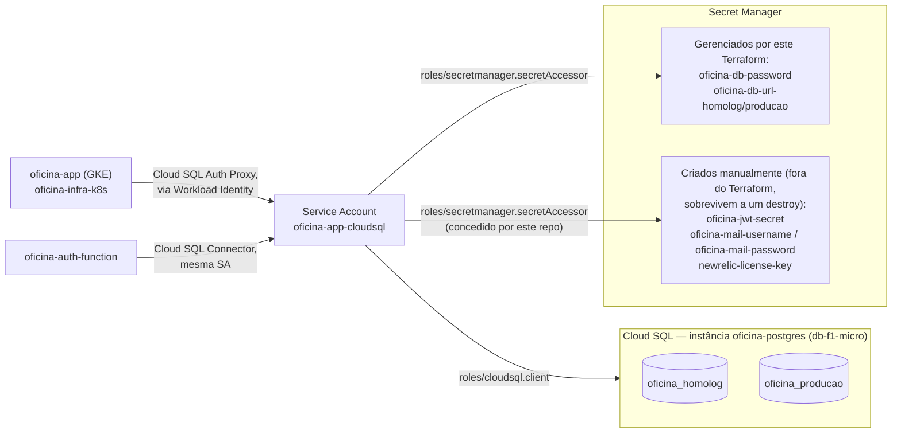

# oficina-infra-db

Infraestrutura do Banco de Dados Gerenciado (Terraform) do Tech Challenge
Fase 3 (Pós-Tech SOAT).

Um dos 4 repositórios exigidos pelo desafio, responsável por provisionar o
banco de dados gerenciado (Cloud SQL PostgreSQL) usado pela aplicação
principal ([`oficina`](https://github.com/robsonago/oficina)) e pela function
de autenticação por CPF
([`oficina-auth-function`](https://github.com/robsonago/oficina-auth-function)),
com bancos separados para homologação (`oficina_homolog`) e produção
(`oficina_producao`) dentro da mesma instância. Justificativa da escolha do
motor/tier em
[RFC-002](https://github.com/robsonago/oficina/blob/main/docs/rfcs/002-escolha-banco-de-dados.md).

Dockerfile não se aplica a este repositório (Terraform não usa Docker).

## Índice

1. [Diagrama deste repositório](#1-diagrama-deste-repositório)
2. [O que este repositório provisiona](#2-o-que-este-repositório-provisiona)
3. [Stack](#3-stack)
4. [Pré-requisitos](#4-pré-requisitos)
5. [Como rodar](#5-como-rodar)
6. [CI/CD](#6-cicd)
7. [Saídas relevantes](#7-saídas-relevantes)
8. [Ambiente ativo](#8-ambiente-ativo)

---

## 1. Diagrama deste repositório



Diagrama geral de todo o sistema em
[`oficina/docs/arquitetura/diagrama-componentes.md`](https://github.com/robsonago/oficina/blob/main/docs/arquitetura/diagrama-componentes.md).

## 2. O que este repositório provisiona

- Instância Cloud SQL `oficina-postgres` (PostgreSQL 16, `db-f1-micro`,
  `southamerica-east1`), sem rede externa autorizada — só acessível via Cloud
  SQL Auth Proxy/Connector.
- Databases `oficina_homolog` e `oficina_producao` na mesma instância, e o
  usuário de aplicação (`oficina`, senha gerada aleatoriamente).
- Secrets no Secret Manager: `oficina-db-password` e as URLs JDBC completas
  (`oficina-db-url-homolog`/`producao`).
- Service Account `oficina-app-cloudsql`, com:
  - `roles/cloudsql.client` no projeto;
  - acesso de leitura (`roles/secretmanager.secretAccessor`) ao secret da
    senha do banco;
  - acesso de leitura aos secrets criados **manualmente** fora deste
    Terraform (`oficina-jwt-secret`, `oficina-mail-username`,
    `oficina-mail-password`) — importante: como essa service account é
    recriada do zero a cada `terraform destroy`+`apply`, essa concessão
    **precisa** estar como código aqui (não só ter sido dada uma vez via
    `gcloud`), senão some na próxima recriação e quebra o deploy das Cloud
    Functions (`Permission denied on secret`).

Essa mesma service account é reaproveitada (via Workload Identity) pela
aplicação principal no GKE e pela function `oficina-auth-function` — só uma
identidade para gerenciar, não uma por consumidor.

## 3. Stack

- Terraform >= 1.6
- Provider `hashicorp/google` ~> 6.0
- Cloud SQL para PostgreSQL 16 (`db-f1-micro`)
- Secret Manager
- State remoto em bucket GCS (`oficina-501820-tfstate`, prefixo `infra-db`)

## 4. Pré-requisitos

- `gcloud` autenticado (`gcloud auth application-default login`) e projeto
  configurado (`gcloud config set project oficina-501820`).
- APIs habilitadas: `sqladmin.googleapis.com`, `secretmanager.googleapis.com`.
- Bucket de state já criado (`gcloud storage buckets create ...`).
- Os secrets `oficina-jwt-secret`, `oficina-mail-username` e
  `oficina-mail-password` já devem existir no Secret Manager (criados
  manualmente uma única vez — não são recriados por este Terraform, mas a
  permissão de acesso a eles é gerenciada aqui).

## 5. Como rodar

```bash
terraform init
terraform plan -var-file=terraform.tfvars    # copie terraform.tfvars.example
terraform apply -var-file=terraform.tfvars
```

> A senha e o IP público gerados são novos a cada recriação da instância —
> nunca copie a senha antiga de um lugar salvo; sempre busque a atual no
> Secret Manager (`gcloud secrets versions access latest --secret=oficina-db-password`).

## 6. CI/CD

O workflow [`.github/workflows/terraform.yml`](.github/workflows/terraform.yml)
roda automaticamente:

- **Pull Request** (para `main`): `terraform plan`.
- **Push em `main`**: `terraform apply` automático.

Autenticação via Workload Identity Federation (sem chave de service account
em segredo).

## 7. Saídas relevantes

- `instance_connection_name`: usado pelo Cloud SQL Auth Proxy/Connector no
  GKE e na Cloud Function de autenticação.
- `secret_db_password_id`: nome do secret no Secret Manager com a senha do
  usuário de aplicação.
- `public_ip_address`: IP público da instância (sem rede autorizada — só
  alcançável via proxy autenticado).

## 8. Ambiente ativo

_Este repositório não expõe um endpoint próprio — a instância só é acessível
via proxy autenticado pelos outros repositórios (`oficina`,
`oficina-auth-function`). Link do ambiente ativo da aplicação: ver README de
[`oficina-infra-k8s`](https://github.com/robsonago/oficina-infra-k8s)._
